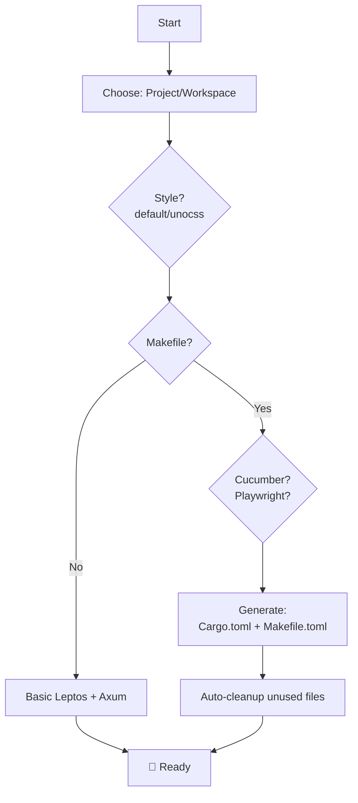

# Leptos Axum Starter Template

Leptos template with Axum SSR, optional testing, and automated workflows

## Quick Start

Prerequisites

```bash
# Install Rust WASM target
rustup target add wasm32-unknown-unknown

# Install tools
cargo install cargo-leptos cargo-generate cargo-make
```

Create Project

```bash
# Method 1: cargo-generate (interactive)
cargo generate --git https://github.com/ritzier/start-leptos-workspace

# Method 2: cargo-leptos
cargo leptos new --git https://github.com/ritzier/start-leptos-workspace my-app
```

### Interacitve Prompts

```
? What is the project name? my-leptos-app
? Which template? (Project/Workspace) Workspace
? Makefile (leptos startup, tests)? yes
? Cucumber test? yes
? Playwright test? no
```

### Commands

```bash
# Development (hot reload)
cargo leptos watch

# Build production
cargo leptos build --release

# Run tests
cargo make chrome        # Cucumber Chrome
cargo make firefox       # Cucumber Firefox
cargo make playwright    # Playwright E2E

# Full test suite
cargo make both
```

## Workflow



## Structure

```text
my-leptos-app/
├── Cargo.toml             # Workspace config
├── Makefile.toml          # Task runner
├── uno.config.ts         # UnoCSS config (if selected)
├── package.json          # UnoCSS deps (if selected)
├── app/                  # Shared logic (Workspace only)
├── frontend/             # WASM lib (Workspace only)
├── server/               # Axum server (Workspace only)
├── src/                  # App + SSR (Project only)
├── public/uno.css        # Generated UnoCSS (if selected)
├── tests/
│   └── cucumber_test/    # Cucumber BDD tests
└── tests/playwright/     # Playwright E2E
```

## Styling Options

- **Default**: Uses Leptos built-in CSS bundling (`/pkg/{{project-name}}.css`)

- **UnoCSS**: Atomic CSS engine with:
  - Auto pattern scanning from `src/**/*.rs` (Project) or `app/**/*.rs` (Workspace)
  - Output to `public/uno.css`
  - `npm run watch` for development HMR
  - `npm run build` for production minification
