# Leptos Axum Starter Template

Leptos template with Axum SSR, optional testing, and automated workflows

## Quick Start

Prerequisites

```bash
# Install Rust WASM target
rustup target add wasm32-unknown-unknown

# Install tools
cargo install cargo-leptos cargo-generate cargo-make
```

Create Project

```bash
# Method 1: cargo-generate (interactive)
cargo generate --git https://github.com/ritzier/start-leptos-workspace

# Method 2: cargo-leptos
cargo leptos new --git https://github.com/ritzier/start-leptos-workspace my-app
```

### Interacitve Prompts

```
? What is the project name? my-leptos-app
? Which template? (Project/Workspace) Workspace
? Makefile (leptos startup, tests)? yes
? Cucumber test? yes
? Playwright test? no
```

### Commands

```bash
# Development (hot reload)
cargo leptos watch

# Build production
cargo leptos build --release

# Run tests
cargo make chrome        # Cucumber Chrome
cargo make firefox       # Cucumber Firefox
cargo make playwright    # Playwright E2E

# Full test suite
cargo make both
```

## Workflow

```mermaid
flowchart TD
    A[Start] --> B[Choose: Project/Workspace]
    B --> C{Makefile?}
    C -->|No| D[Basic Leptos + Axum]
    C -->|Yes| E{Cucumber?<br/>Playwright?}
    E --> F[Generate:<br/>Cargo.toml + Makefile.toml]
    F --> G[Auto-cleanup unused files]
    D --> H[🚀 Ready]
    G --> H
```



## Structure

```text
my-leptos-app/
├── Cargo.toml             # Workspace config
├── Makefile.toml          # Task runner
├── app/                   # Shared logic (Workspace only)
├── frontend/              # WASM lib (Workspace only)
├── server/                # Axum server (Workspace only)
├── src/                   # App + SSR (Project only)
├── tests/
│   └── cucumber_test/     # Cucumber BDD tests
└── tests/playwright/      # Playwright E2E
```
